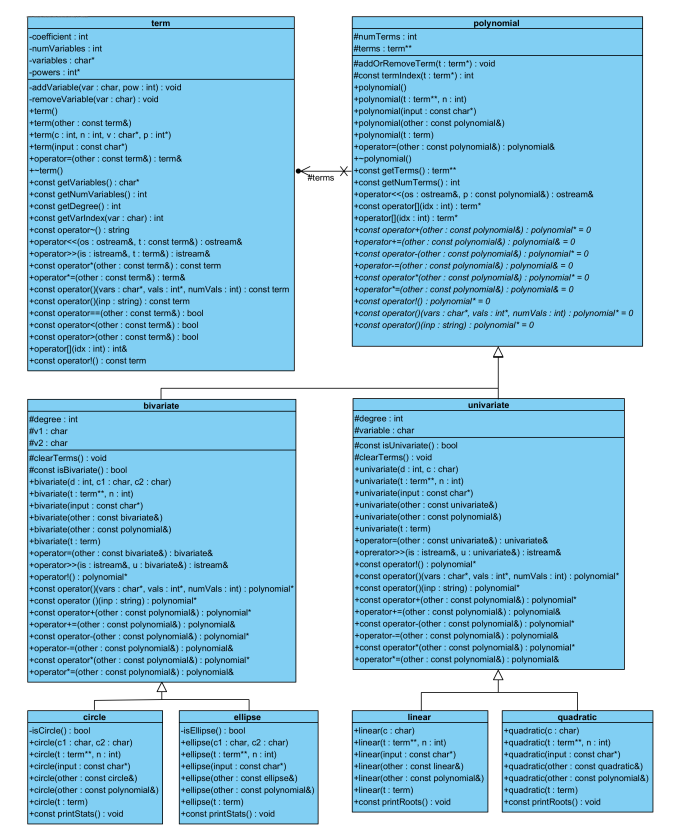

# Polynomial Calculator

- Polynomials are mathematical objects which are expressions of variables and coefficients added to-gether. These polynomials can use operator overloading in a very intuitive manner since most of the operators that we can overload are mathematical operators, which can also be applied to polynomials.
- In this implementation I will create a polynomial class, as well as a few derived classes, which will inherit some of the basic functionality of polynomials but add their own restrictions.

    

---

- ## Section 1: Polynomial Calculator

    - ##### `term`:
        - This class will be used as the terms inside polynomials.  A term in a polynomial consists of a coefficient, which for simplicity reasons, will be an integer value. A term will also contain a number of variables. Every variable will have a positive power.
        - Note that a variable to the power 0, won’t be stored because this is the same as multiplying by 1.  Negative powers are not allowed since polynomials can only contain positive powers.
    - ##### `polynomial`:
        - This is an abstract class that will be used to represent a polynomial.
        - A polynomial is a collection of terms which are added together.

    - ##### `univariate`:
        - Univariate inherits publicly from polynomial. This is a specialized version of polynomial, with 2 restrictions.
            - The first restriction is that the polynomial can only contain one type of variable.
            - The second restriction is a degree restriction.
        - The univariate class has a degree variable. All terms in the univariate must have a degree less than or equal to the degree variable.

    - ##### `bivariate`:
        - Bivariate inherits publicly from polynomial. This is a specialized version of polynomial, with 2 restrictions.
            - The first restriction is that the polynomial can have at most 2 types of variables.
            - The second restriction is a degree restriction.
        - The bivariate class has a degree variable. All terms in the bivariate must have a degree less than or equal to the degree variable.

    - ##### `linear`:
        - Linear inherits publicly from univariate. This is a specialised version of univariate.
        - In this class, the degree variable is set to 1

    - ##### `quadratic`:
        - Quadratic inherits publicly from univariate. This is a specialised version of univariate.
        - In this class, the degree variable is set to 2
    - ##### `circle`:
        - Circle inherits publicly from bivariate. This is a specialised version of bivariate.
        - In this class, the degree variable is set to 2. Additionally, we will only be using circles centred around the origin. Thus only three terms are allowed.
        - The first and second terms must have a degree of 2, and the last term must have a degree of 0.
        - The first two terms must also have the same coefficient.

    - ##### `ellipse`:
        - Ellipse inherits publicly from bivariate. This is a specialised version of bivariate. In this class, the degree variable is set to 2. Additionally, we will only be using ellipses centred around the origin.
        - Thus only three terms are allowed. The first and second terms must have a degree of 2, and the last term must have a degree of 0.

- ## Section 2: Memory Management

    - As memory management is a core part of C++, the aim is to  ensure, at all times, that the code correctly de-allocates all the memory that was allocated.
    - The following command is used:
        ```C++
        valgrind --leak-check=full ./main
        ```
    - ###### `Testing`:

        - As testing is a vital skill that all software developers need to know and be able to perform daily, In order to determine the coverage of your testing the gcov tool, specifically the following version gcov (Debian 8.3.0-6) 8.3.0, will be used.
        - The following set of commands will be used to run gcov:
            ```C++
            g++ --coverage  *.cpp -o main
            ./main
            gcov -f -m -r -j term  polynomial  univariate  bivariate  linear  quadratic  circle ellipse
            ```
---

- ## Section 2: Requirements before running Code:

  - Install an `IDE` that compiles and runs C++ codes.
    - 1st Recommendation: `VS Code`
    - 2nd Recommendation: `IntelliJ IDEA`
    - 3rd Recommendation: `Visual Studio`
  - Setup Video:
    - Title: How to set up WSL Ubuntu terminal shell and run it from Visual Studio Code
    - Video Link: [Youtube-Video-Link](https://www.youtube.com/watch?v=fp45HpZuhS8&t=112s)
    - Installing Coverage (Linux (Debian/Ubuntu)):
        - sudo apt-get update
        - sudo apt-get install gcov
        - sudo apt-get install lcov
        - which gcov
        - which lcov
    - Installing Valgrind (Linux (Debian/Ubuntu)):
        - sudo apt-get install valgrind


  - ###### NB: The makefile is included to compile and run the code on the terminal.
    - ###### `Commands:=`
        - make (to build the main executable).
        - make clean (to clean up generated files).
        - make run (to run the program with valgrind (assuming you have installed valgrind)).
        - make tar (to create a tarball of your project).
        - make untar (to extract the contents of the tarball).
        - make coverage (to generate coverage reports (assuming you have installed lcov)).

    ```C++
    main:
        g++ -g *.cpp -std=c++98 -pedantic -o main

    clean:
        rm -f *.o *.tar.gz main
        reset
        clear

    run:
        valgrind --leak-check=full ./main

    tar:
        tar -cvz *.* -f Code.tar.gz

    untar:
        tar -zxvf *.tar.gz

    test:
        g++ --coverage *.cpp -o main
        gcov -f -m -r -j term polynomial univariate bivariate linear quadratic circle ellipse
        ./main
        lcov -c -d . -o coverage.info
        genhtml coverage.info -o coverage_report

    ```

---

---

<p align="center">The End, Thank You</p>

---

---
